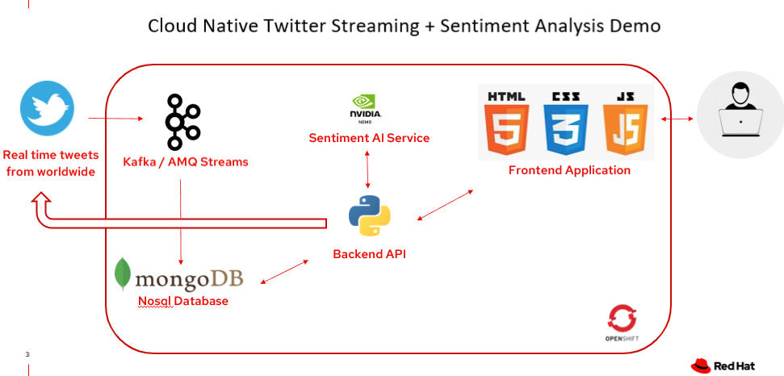

# Red Hat Integration Suite Demo with Twitter and Nvidia Nemo Sentiment Model



Pre-requisite: You must have an OpenShift Container Platform with sufficient administrative rights to install operators, create projects and configure workloads. The following demo is based on Openshift 4.8. You also need to have a developer account in Twitter.

Red Hat Integration is a comprehensive set of integration and messaging technologies to connect applications and data across hybrid infrastructures. 

It is an agile, distributed, containerized and API-centric solution. 

It provides service composition and orchestration, application connectivity and data transformation, real-time message streaming, change data capture, and API management—all combined with a cloud-native platform and toolchain to support the full spectrum of modern application development.

This repo is with reference to https://github.com/ksingh7/twitter_streaming_app_on_openshift_OCS with some updated codes and modification. Give credits to Karan Singh.

## Instruction

### Deploy Kafka / AMQ Streams Messaging Service 

1. Install AMQ Streams Operator

Under **Administrator** view, click Operators -> OperatorHub -> Red Hat Integration - AMQ Streams -> Install

Next, select installation mode to be on a specific namespace and create new namespace called "amq-streams". It will take roughly a min to finish installation.

When it is done, click "View Operator". You should see a page which you can manage your Kafka usage.

2. Create a Kafka cluster

Inside the operator, click "Create kafka". For simplicity, you can keep all default configuration the same. Let's name it as "my-cluster". 

3. Create a Kafka topic

Inside the operator, click "Kafka topic" -> "Create kafkaTopic". Name the topic as "tweets".

### Deploy a MongoDB service on openshift

1. Login to your OCS cli

```
oc login --token=<your-token> --server=<your-server>
oc project amq-streams
```

2. Git clone application repository

```
git clone https://github.com/jyew/red_hat_integration_demo.git
cd red_hat_integration_demo
```

3. Create MongoDB template
```
oc create -f 01-ocs-mongodb-persistent-template.yaml -n openshift
oc -n openshift get template mongodb-persistent-ocs
```

4. Create MongoDB app

```
oc new-app -n amq-streams --name=mongodb --template=mongodb-persistent-ocs \
    -e MONGODB_USER=demo \
    -e MONGODB_PASSWORD=demo \
    -e MONGODB_DATABASE=twitter_stream \
    -e MONGODB_ADMIN_PASSWORD=admin
```

### Deploy Nemo Sentiment Microservice

1. Create persistent volume claim

On OCS, click "Storage" -> "PersistentVolumeClaims" -> "Create PersistentVolumeClaim". 

Name it as "nemo-storage-claim" and allocate 2GB of size to it.

2. Deploy Nemo Sentiment service
```
oc new-app https://github.com/jyew/red_hat_integration_demo.git \
    --context-dir=tweet_sentiment -n amq-streams --name=sentiment
```

3. Mount persistent volume and expose it
```
oc set volume deploy/sentiment --add --name=v1 -t pvc --claim-name=nemo-storage-claim --overwrite
```
```
oc expose svc/sentiment
```

### Deploy Python Backend Flask API service

1. Allow container to run as root

```
oc adm policy add-scc-to-user anyuid -z default
```

2. Deploy backend API APP

```
oc new-app --name=backend --image=jyew1992/kafka-demo-backend-service:latest --env IS_KAFKA_SSL='False' --env MONGODB_ENDPOINT='mongodb:27017' --env KAFKA_BOOTSTRAP_ENDPOINT='my-cluster-kafka-bootstrap:9092' --env 'KAFKA_TOPIC=tweets' --env TWTR_CONSUMER_KEY='<YOUR_KEY_HERE>' --env TWTR_CONSUMER_SECRET='<YOUR_KEY_HERE>' --env TWTR_ACCESS_TOKEN='<YOUR_KEY_HERE>' --env TWTR_ACCESS_TOKEN_SECRET='<YOUR_KEY_HERE>' --env MONGODB_HOST='mongodb' --env MONGODB_PORT=27017 --env MONGODB_USER='demo' --env MONGODB_PASSWORD='demo' --env MONGODB_DATABASE='twitter_stream' --env SENTIMENT_ROUTE='http://sentiment-amq-streams.apps.cluster-db23.db23.sandbox1764.opentlc.com' -o yaml > 02-backend.yaml
```
```
oc apply -f 02-backend.yaml ; oc expose svc/backend

```

### Deploy Frontend Service

1. Grab the backend route

```
oc get route backend --no-headers | awk '{print $2}'
```

2. Edit frontend/results.html, Line-107 ``var url`` and update route

3. Build Frontend Docker image

```
cd frontend

docker build -t kafka-demo-frontend-service:latest .
docker tag kafka-demo-frontend-service:latest jyew1992/kafka-demo-frontend-service:latest
docker push jyew1992/kafka-demo-frontend-service
```
```
oc new-app --name=frontend --image=jyew1992/kafka-demo-frontend-service:latest ; oc expose svc/frontend ; oc get route frontend
```

### 3scale to protect API


### (Optional) Deploy Fuse Online


